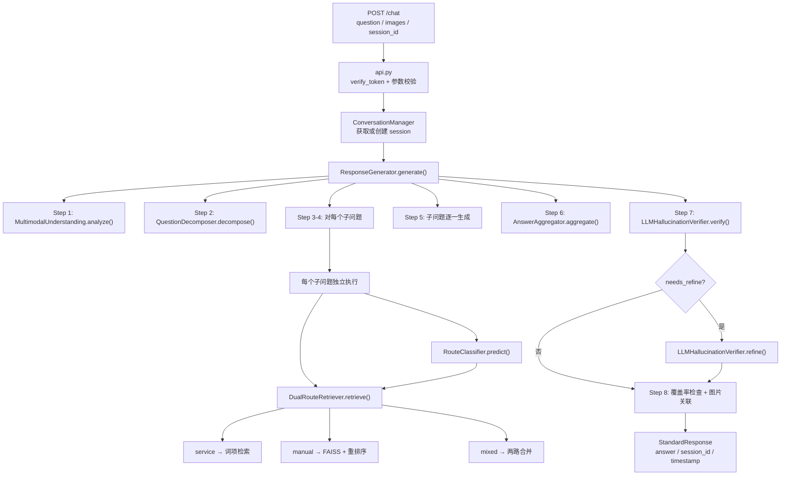

# 项目技术架构文档

**版本**: 2026-05-03
**适用对象**: 首次接手本项目的开发人员、技术评审人员、部署运维人员

---

## 目录

1. [项目整体说明](#1-项目整体说明)
2. [目录结构与职责分层](#2-目录结构与职责分层)
3. [整体运行流程图](#3-整体运行流程图)
4. [核心功能流程细化图](#4-核心功能流程细化图)
5. [代码位置索引](#5-代码位置索引)
6. [主链路与辅助链路区分](#6-主链路与辅助链路区分)
7. [配置参数说明](#7-配置参数说明)
8. [建议阅读顺序](#8-建议阅读顺序)

---

## 1. 项目整体说明

### 1.1 项目要解决什么问题

本项目是一套面向比赛场景的**多模态客服智能体**，完整链路如下：

```
用户输入（文本 + 图片）
    → 理解 → 分解 → 路由 → 检索 → 生成 → 验证 → 回答
```

要解决的四个核心问题：

1. **多模态理解**: 用户问题可能是纯文本、附带图片、或图片加文字。需要解析图片内容、提取产品线索、判断证据类型（service_like / manual_like / mixed_like）。
2. **精准检索**: 产品手册知识和客服政策知识分开管理。客服类问题（退款、投诉、发票）和产品使用类问题（说明书、操作步骤）需要路由到不同知识源。
3. **多轮对话**: 同一 `session_id` 下多轮问答需要保持上下文一致性。
4. **幻觉抑制**: 禁止编造手册内容、政策细节或图片编号；无法确认的内容必须保守表达；小模型修正器负责在生成后验证并修正不一致的答案。

### 1.2 整体架构由哪些模块组成

```
src/api.py                          # FastAPI HTTP 入口
    │
    ├── ConversationManager          # 多 session 状态管理
    │
    └── ResponseGenerator           # 主编排器（8 步流程）
            │
            ├── MultimodalUnderstanding   # 图片+文本结构化理解
            ├── QuestionDecomposer        # 结构化问题分解（CoT）
            │       └── 每个子问题独立路由
            │
            ├── DualRouteRetriever       # 双路检索编排
            │       ├── RouteClassifier  (ONNX 轻量三分类)
            │       └── RAGEngine        (FAISS 向量检索)
            │
            ├── AnswerAggregator         # 子问题回答聚合
            ├── LLMHallucinationVerifier  # 小模型幻觉验证
            └── LLMSpellCorrector        # 拼写纠错（可选）

辅助工具:
    ├── LLMHallucinationVerifier     # 小模型答案修正 (qwen2.5-1.5b)
    └── LLMSpellCorrector           # 小模型拼写纠错 (qwen2.5-0.5b)
```

### 1.3 各模块之间的关系

| 上游模块 | 依赖下游 | 说明 |
|---------|---------|------|
| `api.py` | `ResponseGenerator` | 只做 HTTP 协议封装和响应格式映射，不含业务逻辑 |
| `ResponseGenerator` | `MultimodalUnderstanding` | 可选，失败不阻断 |
| `ResponseGenerator` | `QuestionDecomposer` | 结构化问题分解，失败回退规则拆分 |
| `ResponseGenerator` | `DualRouteRetriever` | 所有检索必经之路 |
| `ResponseGenerator` | `LLMHallucinationVerifier` | 可选，默认启用，失败不阻断 |
| `DualRouteRetriever` | `RAGEngine` | 实际 FAISS 向量检索 |
| `DualRouteRetriever` | `RouteClassifier` | ONNX 分类，可降级规则路由 |
| `DualRouteRetriever` | `LLMSpellCorrector` | query 纠错，失败不阻断 |

---

## 2. 目录结构与职责分层

### 2.1 完整目录树

```
D:\multimodal-agent
├── src/                          # 【主链路】线上业务代码
│   ├── api.py                    # FastAPI 入口，所有 HTTP 端点
│   ├── main.py                   # CLI 入口（api / build / interactive / test）
│   ├── __main__.py               # 支持 python -m src 启动
│   ├── modules/                  # 核心业务模块包（惰性导入）
│   │   ├── __init__.py           # 惰性导出，避免拉起重型依赖
│   │   ├── multimodal_understanding.py  # 多模态理解（结构化理解结果）
│   │   ├── question_decomposer.py       # 结构化问题分解（CoT）
│   │   ├── route_classifier.py          # ONNX 轻量三分类器
│   │   ├── dual_route_retriever.py      # 双路检索编排（service/manual/mixed）
│   │   ├── rag_engine.py                # FAISS 向量检索 + Reranker
│   │   ├── response_generator.py         # 主编排器（8 步流程）
│   │   ├── hallucination_controller.py   # 幻觉抑制（含 LLM 小模型验证器）
│   │   └── conversation_manager.py      # 多 session 状态管理
│   └── utils/
│       ├── __init__.py
│       ├── text_utils.py          # TextProcessor、QueryProcessor
│       ├── image_utils.py         # ImageProcessor、图片 ID 提取
│       └── llm_corrector.py       # LLM 驱动的拼写纠错器
│
├── scripts/                      # 【离线脚本】知识库构建 / 评测 / 训练
│   ├── build_knowledge_base.py         # FAISS 索引构建
│   ├── build_dual_route_kb.py          # 客服路由知识库构建
│   ├── build_route_classifier_dataset.py # 分类器弱标注数据集
│   ├── train_route_classifier.py        # PyTorch → ONNX 训练
│   ├── process_manuals_with_model.py    # 大模型章节化整理
│   ├── convert_model_kb_to_payload.py   # 章节化结果转建库 payload
│   ├── evaluate_retrieval.py            # 检索召回率评测
│   ├── evaluate_dual_route.py           # 双路路由效果评测
│   ├── generate_public_answers.py        # 批量生成提交文件
│   ├── benchmark_chat.py                 # API 性能压测
│   ├── scan_route_thresholds.py         # 路由阈值参数扫描
│   ├── audit_route_dataset.py           # 数据集质量审计
│   ├── diagnose_manual_route.py          # 手册检索诊断工具
│   └── sample_data.py                   # 数据采样
│
├── tests/                        # 【测试代码】
│   ├── test_modules.py           # 单元测试
│   └── test_api.py               # API 集成测试
│
├── config/                       # 【配置文件】
│   └── settings.py               # 全量配置参数
│
├── knowledge_base/               # 【知识库数据】
│   ├── index/                   # FAISS 索引 + metadata.json
│   ├── routes/                  # 客服路由知识库 JSON
│   ├── seeds/                   # 客服政策种子数据
│   ├── route_classifier/        # 分类器 ONNX 模型 + 训练数据
│   └── evaluation/              # 各次评测的输出结果
│
├── 手册/                        # 【原始知识源】产品手册 JSON
├── 手册/插图/                    # 【原始知识源】手册配图
├── docs/                        # 【文档】
└── .env                         # 【环境变量】API Key、模型配置
```

### 2.2 `src/` 主链路文件说明

| 文件 | 行数 | 职责 | 类型 |
|------|------|------|------|
| `response_generator.py` | ~1622 | 主编排器，8 步流程串联所有子模块 | 主链路 |
| `dual_route_retriever.py` | ~1203 | 双路检索编排 + 评分函数 | 主链路 |
| `rag_engine.py` | ~924 | FAISS 向量检索 + Reranker | 主链路 |
| `hallucination_controller.py` | ~822 | 小模型验证器 + 修正器 | 主链路 |
| `multimodal_understanding.py` | ~606 | 图片+文本结构化理解 | 主链路（可选） |
| `conversation_manager.py` | ~475 | 多 session 状态管理 | 主链路 |
| `question_decomposer.py` | ~539 | 结构化问题分解（CoT） | 主链路（可选） |
| `route_classifier.py` | ~255 | ONNX 轻量三分类 | 主链路（可降级） |
| `api.py` | ~477 | FastAPI HTTP 入口 | 主链路 |
| `utils/llm_corrector.py` | ~235 | 拼写纠错 | 主链路（可选） |

### 2.3 `scripts/` 离线脚本说明

| 脚本 | 类型 | 作用 |
|------|------|------|
| `build_knowledge_base.py` | 建库 | 手册 JSON → FAISS 索引 |
| `build_dual_route_kb.py` | 建库 | 构建客服路由知识库 JSON |
| `process_manuals_with_model.py` | 建库 | 大模型章节化整理手册 |
| `convert_model_kb_to_payload.py` | 建库 | 章节化结果转 payload |
| `generate_public_answers.py` | 评测 | 批量生成提交文件 |
| `evaluate_retrieval.py` | 评测 | 检索召回率评测 |
| `evaluate_dual_route.py` | 评测 | 双路路由评测 |
| `benchmark_chat.py` | 评测 | API 性能压测 |
| `scan_route_thresholds.py` | 调试 | 阈值参数扫描 |
| `diagnose_manual_route.py` | 调试 | 手册检索诊断 |
| `build_route_classifier_dataset.py` | 训练 | 分类器数据集生成 |
| `train_route_classifier.py` | 训练 | PyTorch → ONNX |
| `audit_route_dataset.py` | 训练 | 数据集质量审计 |
| `sample_data.py` | 工具 | 数据采样 |

---

## 3. 整体运行流程图

### 3.1 在线主链路流程（Mermaid）



### 3.2 在线主链路详细数据流

```
HTTP POST /chat { question, images?, session_id? }
    │
    ▼
┌──────────────────────────────────────────────────────────────┐
│ api.py - chat()                                              │
│  1. verify_token() Bearer 认证                               │
│  2. ChatRequest 参数校验                                      │
│  3. ConversationManager: 获取或创建 session                   │
│  4. 添加用户消息到历史                                        │
│  5. 调用 response_generator.generate()                        │
│  6. 添加助手回复到历史                                        │
│  7. 返回 StandardResponse                                    │
└──────────────────────────────────────────────────────────────┘
    │
    ▼
┌──────────────────────────────────────────────────────────────┐
│ ResponseGenerator.generate() - 8 步主编排                       │
│                                                               │
│ Step 1: MultimodalUnderstanding.analyze()                     │
│   输入: query, images, history                                │
│   输出: MultimodalUnderstandingResult {                       │
│           normalized_query, image_tags,                       │
│           product_candidates, evidence_type, confidence       │
│         }                                                    │
│   → 提取图片标签、产品线索、证据类型，失败不阻断                │
│                                                               │
│ Step 2: QuestionDecomposer.decompose()                        │
│   输入: query, history, mm_result                             │
│   输出: DecompositionResult {                                 │
│           should_decompose, sub_questions[],                  │
│           answer_strategy, confidence                         │
│         }                                                    │
│   → 规则版先行；置信度不足时调用 LLM；失败回退单问            │
│                                                               │
│ Step 3-4: 对每个子问题独立执行路由+检索                      │
│   输入: SubQuestion { text, intent_hint, needs_image }       │
│   → RouteClassifier.predict() → 路由标签                       │
│   → DualRouteRetriever.retrieve() → 检索结果                  │
│   → _answer_sub_question() → 单个子问题生成                   │
│                                                               │
│ Step 5: 子问题逐一生成                                        │
│   输入: 各子问题的检索结果                                      │
│   输出: sub_answers[]                                         │
│                                                               │
│ Step 6: AnswerAggregator.aggregate()                          │
│   输入: decomp.answer_strategy, sub_answers[]                │
│   输出: final_answer（按 sequential / grouped / single 聚合） │
│                                                               │
│ Step 7: LLMHallucinationVerifier.verify()                    │
│   输入: final_answer, sources[]                              │
│   输出: VerificationResult { is_consistent, confidence }      │
│   → needs_refine=True → refine() 修正                        │
│                                                               │
│ Step 8: 覆盖率检查 + 图片关联                                 │
│   → 检查各子问题是否被回答，漏答则补漏                        │
│   → 提取检索结果中 image_ids，最多 5 张                       │
└──────────────────────────────────────────────────────────────┘
    │
    ▼
{ code: 0, data: { answer, session_id, timestamp } }
```

---

## 4. 核心功能流程细化图

### 4.1 API 请求处理

```
POST /chat { question, images?, session_id? }
        │
        ├── verify_token() ── Token 无效 → HTTP 401
        │
        ├── ChatRequest 校验
        │   ├─ question 非空
        │   ├─ images 最多 3 张，每张 ≤ 5MB
        │   └─ session_id 可选
        │
        ├── session 处理
        │   ├─ 有 session_id → conversation_manager.get_session()
        │   └─ 无 session_id → conversation_manager.create_session() 新建
        │
        ├── conversation_manager.add_message(role="user")
        │
        ├── response_generator.generate(query, images, history)
        │
        ├── conversation_manager.add_message(role="assistant")
        │
        └── 返回 StandardResponse
```

**全部端点一览**:

| 端点 | 方法 | 用途 |
|------|------|------|
| `/chat` | POST | 核心对话入口 |
| `/session/create` | POST | 创建新会话 |
| `/session/{id}` | GET | 获取会话信息 |
| `/session/{id}` | DELETE | 删除会话 |
| `/knowledge/add` | POST | 增量添加文档 |
| `/knowledge/build` | POST | 构建索引 |
| `/knowledge/retrieve` | POST | 查询知识库 |
| `/health` | GET | 健康检查 |

---

### 4.2 多轮对话管理

```
会话上下文（ConversationContext）
    │
    ├── session_id: 唯一标识
    ├── messages: Message[]  (role, content, images, timestamp)
    ├── created_at / last_active
    ├── user_info
    └── state: active / completed / expired

操作:
    │
    ├── create_session(user_id?)
    │   └─ 返回新 session_id
    │
    ├── add_message(session_id, role, content, images?)
    │   ├─ 追加消息到 messages[]
    │   └─ 超过 max_conversation_history*2 时自动裁剪最旧半量
    │
    ├── get_conversation_history(session_id, limit?)
    │   └─ 返回最近 N 条消息
    │
    └── clear_session(session_id)
        └─ 删除会话
```

---

### 4.3 多模态理解

**`src/modules/multimodal_understanding.py` - MultimodalUnderstanding.analyze()**

```
输入: query 文本 + images Base64 列表 + history
        │
        ├── 图片处理（如有 images）
        │   ├─ 解码 Base64
        │   ├─ PIL Image.open() 验证格式
        │   └─ 提取 PIL 图像供后续使用
        │
        ├── LLM 多模态分析
        │   ├─ 构造 Prompt（含图片内容描述、产品线索、证据类型）
        │   ├─ 调用 GPT-4o（超时 5s，可配置）
        │   └─ 解析 JSON 响应
        │
        └── 输出 MultimodalUnderstandingResult
            ├─ normalized_query: 归一化查询文本
            ├─ image_tags: 图片稳定标签列表
            ├─ product_candidates: 候选产品名
            ├─ visual_intents: 视觉意图列表
            ├─ evidence_type: service_like / manual_like / mixed_like / unknown
            └─ confidence: 置信度

输出: MultimodalUnderstandingResult（失败时返回 defaults，降级不阻断）
```

---

### 4.4 结构化问题分解（CoT）

**`src/modules/question_decomposer.py` - QuestionDecomposer.decompose()**

```
输入: query + history + mm_result（可选）
        │
        ├── Step 1: _rule_based_split() 规则版拆分
        │   ├─ 策略1: 显式标点分割（？；）→ confidence=0.95
        │   ├─ 策略2: 换行分割 → confidence=0.92
        │   ├─ 策略3: 连接词模式（顺便/另外/还有）→ confidence=0.88
        │   ├─ 策略4: 逗号隐式多问 → confidence=0.80
        │   ├─ 策略4b: 顿号列举拆分 → confidence=0.82
        │   └─ 策略5: 重复疑问模式（X吗Y吗Z吗）→ confidence=0.78
        │   └─ 无法拆分 → should_decompose=False, confidence=1.0
        │
        ├── 规则判断不需要拆分 → 直接返回（快速路径）
        │
        ├── Step 2: 置信度不足时调用 LLM（_llm_decompose）
        │   ├─ 超时 4s（可配置）
        │   ├─ 构造 Prompt（含 history + mm_signal）
        │   ├─ 输出 JSON（should_decompose, sub_questions, answer_strategy）
        │   └─ JSON 解析失败 → 回退规则版
        │
        └── 输出 DecompositionResult
            ├─ should_decompose: bool
            ├─ sub_questions: List[SubQuestion {
            │       text, intent_hint, needs_image_support,
            │       depends_on_previous, priority
            │   }]
            ├─ answer_strategy: single / sequential / grouped
            └─ confidence: 0.0~1.0
```

---

### 4.5 路由分类（service / manual / mixed）

**`src/modules/dual_route_retriever.py` - route_query()**

```
输入: query 文本 + images 图片列表
        │
        ├── Step 1: LLMSpellCorrector.correct() 拼写纠错（可选）
        │   └─ 失败 → 使用原始 query
        │
        ├── Step 2: QueryProcessor.normalize_query_for_retrieval() 归一化
        │
        ├── Step 3: 规则路由评分 (_compute_rule_route_info)
        │   ├─ 意图匹配 → matched_intents[]
        │   ├─ 手册别名检测 → candidate_manuals[]
        │   ├─ service/manual 关键词命中统计
        │   ├─ 示例相似度 (_best_example_score)
        │   ├─ 加权求和 → service_score / manual_score
        │   └─ 分数调节（service_only_hits、意图组合条件）
        │
        ├── Step 4: RouteClassifier.predict() ONNX 分类（可降级）
        │   ├─ Featureizer.build_input_text(): 拼接 query + [HAS_IMAGE] + [IMAGE_TAGS]
        │   ├─ Featureizer.encode(): 512 维特征向量
        │   ├─ ONNX Runtime 推理 → [service_prob, manual_prob, mixed_prob]
        │   └─ 返回 label + confidence + margin(top1-top2)
        │
        └── Step 5: _arbitrate_route() 最终裁决
            ├─ 优先级1: 强规则强制路由 → 直接采纳
            ├─ 优先级2: 高置信分类器（confidence≥0.82 且 margin≥0.25）→ 直接采纳
            ├─ 优先级3: 低置信分类器（confidence<0.46 或 margin<0.08）→ 回退规则
            ├─ 优先级4: 分类器与规则一致 → 采纳分类器
            ├─ 优先级5: 任一方为 mixed → 升为 mixed
            ├─ 优先级6: 规则偏好 service（无手册候选 + 有客服意图）
            ├─ 优先级7: 规则偏好 manual（有手册别名命中）
            └─ 优先级8: 中等置信度 → 采纳分类器

输出: { route, rule_score, classifier_label, classifier_confidence, ... }
```

---

### 4.6 Manual 检索

**`src/modules/dual_route_retriever.py` - _retrieve_manual()**

```
输入: query
        │
        ├── _detect_manual_candidates(query) 别名匹配
        │   └─ 返回 [(manual_name, alias_score), ...]
        │
        ├── _should_use_local_manual_recall() 判断局部召回
        │   ├─ 别名得分 ≥ 6.0 → 启用
        │   ├─ 仅 1 候选且得分 ≥ 2.0 → 启用
        │   └─ 得分差 ≥ 2.0 且得分 ≥ 2.0 → 启用
        │
        ├── 启用局部召回
        │   └─ 在候选手册子集内，从 FAISS 恢复向量 + 点积打分
        │       └─ _local_semantic_recall()
        │
        ├── 未启用局部召回 → 全库 broad recall
        │   └─ rag_engine.retrieve(query, top_k=24)
        │
        └── _rerank_manual_docs() 多维评分重排序
            │
            └─ _score_manual_result() 各维度权重:
                ├─ semantic_score (0.34): 向量相似度
                ├─ content_score (0.26): 查询词与内容词项相似度
                ├─ section_score (0.22): 查询词与章节标题相似度
                ├─ alias_score (0.12): 别名命中数量
                ├─ manual_name_score (0.06): 查询与手册名相似度
                ├─ candidate_scaled (0.12): 手册候选加分
                └─ image_bonus (+0.06): 含图文档额外加分
            │
            └─ _apply_diversity_penalty()
                ├─ Top2/Top3 同 section_title → 降 0.05
                └─ 同 section + 相邻 chunk_index → 叠加降 0.03

输出: 重排序后的 top_k 条检索结果
```

---

### 4.7 Service 检索

**`src/modules/dual_route_retriever.py` - _retrieve_service()**

```
输入: query
        │
        ├── _match_service_intents(query) 意图匹配
        │   └─ 遍历所有意图规格，匹配关键词命中
        │
        └── 对每条 service_documents 评分:
            ├─ score (0.52): 查询与文档内容词项相似度
            ├─ title_score (0.12): 查询与标题词项相似度
            ├─ keyword_bonus (0.18): 意图关键词命中加分
            ├─ intent_bonus (+0.18): 命中意图时额外加分
            ├─ doc_type_bonus: service_policy=0.12, service_playbook=0.05
            └─ priority: service_policy=0.82 最高优先级

输出: 词项检索驱动的客服政策结果列表（不依赖向量索引）
```

---

### 4.8 Mixed 检索与合并

```
route == "mixed"
        │
        ├── service_results 取 top 4
        ├── manual_results 取 top 5
        ├── 合并为同一列表
        └── 排序规则:
            ├─ 主键: service 结果优先（route=="service" → 排前）
            └─ 次键: 按 relevance_score 降序

输出: 混合检索结果列表
```

---

### 4.9 回答生成

**`src/modules/response_generator.py` - _answer_sub_question()**

```
输入: SubQuestion + images + mm_result
        │
        ├── 路由预测
        │   └─ RouteClassifier.predict() → route label
        │
        ├── 检索
        │   └─ DualRouteRetriever.retrieve() → results
        │
        ├── 构建上下文
        │   ├─ 检索结果（清理 <PIC>[id] 格式）
        │   ├─ 对话历史（最近 3 轮）
        │   └─ 路由标签标注
        │
        ├── 生成
        │   ├─ 有 LLM → _generate_answer() 调用 GPT-4o
        │   └─ 无 LLM → _generate_fallback_answer() 纯检索驱动
        │
        └── 提取图片 IDs

输出: sub_answer { answer_text, route_packet, route_record }
```

**聚合策略**（AnswerAggregator）:

| strategy | 说明 |
|----------|------|
| `single` | 不拆分，直接使用单问生成结果 |
| `sequential` | 逐个子问题生成，按顺序拼接 |
| `grouped` | 分组回答（适用于列举类问题） |

---

### 4.10 幻觉验证与修正

**`src/modules/hallucination_controller.py` - LLMHallucinationVerifier**

```
LLMHallucinationVerifier.verify()
    输入: answer + sources[] + question
        │
        ├── Step 1: 构造 Prompt
        │   ├─ 保护型号词 / <PIC> 标记不参与验证
        │   └─ Prompt 极简，期望输出 JSON
        │
        ├── Step 2: 调用小模型（qwen2.5-0.5b-instruct）
        │   ├─ 超时 3s（可配置）
        │   ├─ temperature=0.1
        │   └─ 失败 → 回退旧版 HallucinationController
        │
        └── 输出 VerificationResult
            ├─ is_consistent: bool
            ├─ confidence: 0.0~1.0
            ├─ unsupported_claims: []
            └─ needs_refine: bool（confidence<0.65 时为 True）

needs_refine=True → LLMHallucinationVerifier.refine()
    输入: answer + sources[] + question
        │
        ├── 构造修正 Prompt（包含问题、上下文、不一致的 claims）
        ├── 调用小模型（qwen2.5-1.5b-instruct）
        │   ├─ 超时 5s（可配置）
        │   └─ 保护型号词 / <PIC> 标记
        │
        └── 输出 RefinementResult
            ├─ corrected: str（修正后回答）
            ├─ changes: [改动说明列表]
            └─ success: bool（修正后置信度≥0.70 才采纳）
```

---

### 4.11 知识库构建

**`scripts/build_knowledge_base.py` - KnowledgeBaseBuilder**

```
输入: 手册/ 目录下的 JSON 文件
        │
        ├── ManualParser 解析
        │   ├─ 格式: [manual_text, [img_1, img_2, ...]]
        │   ├─ 保留 <PIC> 占位符
        │   └─ 提取图片 ID 列表
        │
        ├── inject_image_ids() 绑定图片
        │   └─ <PIC> → <PIC>[image_id]
        │
        ├── extract_sections() 按标题切章节
        │
        ├── _chunk_text() 固定窗口切分（chunk_size=500, overlap=50）
        │
        ├── RAGEngine.add_documents(doc_type="text")
        │   ├─ BGE-M3 向量化（1024 维）或 hashing 后端
        │   ├─ FAISS 索引更新
        │   └─ metadata.json 追加
        │
        └── 质量校验
            └─ 抽样检查 <PIC> 占位符是否正确保留

输出: knowledge_base/index/ 下索引文件
```

---

### 4.12 检索评测

**`scripts/evaluate_retrieval.py`**

```
输入: question_public.csv
        │
        ├── 对每道题调用 dual_route_retriever.retrieve()
        │
        ├── 评估指标
        │   ├─ Top-K 命中率
        │   ├─ 关键词覆盖度
        │   ├─ 手册命中率（按 manual/service/mixed 分组）
        │   ├─ 错误手册吸走率
        │   └─ 分类器 vs 规则路由对比
        │
        └── 生成报告
            ├─ 逐题检索明细 JSON
            ├─ 逐题摘要
            └─ 总览报告（含 AB 对比）
```

---

### 4.13 路由分类器训练与使用

**训练**（`scripts/train_route_classifier.py`）:

```
输入: 弱标注数据集（question_public.csv + 规则标注）
        │
        ├── RouteClassifierFeatureizer: query → 512 维特征向量
        │   ├─ service/manual/mixed 关键词命中统计
        │   ├─ 文本长度、图片标记等
        │   └─ 可选：image_tags 注入
        │
        ├── LinearRouteClassifier (PyTorch): 512 → 3 全连接层
        │   ├─ 交叉熵损失 + 类别权重
        │   └─ 导出 ONNX（脱离 PyTorch 运行）
        │
        └── 输出: knowledge_base/route_classifier/model/*.onnx

使用**（`src/modules/route_classifier.py`）:
    输入: 归一化 query + images + image_tags
        │
        ├── Featureizer.build_input_text() 拼接
        ├── Featureizer.encode() → 512 维向量
        ├── ONNX Runtime 推理 → [service_prob, manual_prob, mixed_prob]
        │
        └── 返回 { label, confidence, margin, available }
            └─ available=False → 主链路降级规则路由
```

---

## 5. 代码位置索引

### 5.1 主链路核心文件

#### `src/api.py`（~477 行）

| 类 / 函数 | 行号 | 职责 |
|---------|------|------|
| `ChatRequest` | 46 | Pydantic 请求模型 |
| `StandardResponse` | 68 | Pydantic 响应外层 |
| `verify_token()` | 97 | Bearer Token 验证 |
| `chat()` | 190 | 核心对话端点（唯一业务入口） |
| `create_session()` | 272 | 创建会话 |
| `get_session()` | 287 | 获取会话信息 |
| `delete_session()` | 311 | 删除会话 |
| `add_documents()` | 332 | 知识库增量写入 |
| `build_index()` | 371 | 索引构建 |
| `retrieve_knowledge()` | 393 | 知识库查询 |

**输入**: `POST /chat { question, images?, session_id? }`
**输出**: `{ code: 0, data: { answer, session_id, timestamp } }`

---

#### `src/modules/response_generator.py`（~1622 行）

| 类 / 函数 | 行号 | 职责 |
|---------|------|------|
| `ResponseGenerator.generate()` | 124 | 主编排器（8 步） |
| `_run_multimodal_understanding()` | ~260 | Step 1 多模态理解 |
| `_run_question_decomposition()` | ~320 | Step 2 问题分解 |
| `_answer_sub_question()` | ~450 | 子问题路由+检索+生成 |
| `_answer_single_question()` | ~750 | 单问生成（检索驱动兜底） |
| `_aggregate_sub_answers()` | ~550 | Step 6 回答聚合 |
| `_generate_answer()` | ~850 | LLM 生成 |
| `_generate_fallback_answer()` | ~950 | 检索驱动兜底 |
| `_check_subquestion_coverage()` | ~1100 | Step 8 覆盖率检查 |

**输入**: `query, images?, context?, conversation_history?`
**输出**: `{ response, images, sources, reasoning, confidence, routes, multimodal }`

---

#### `src/modules/question_decomposer.py`（~539 行）

| 类 / 函数 | 行号 | 职责 |
|---------|------|------|
| `SubQuestion`（dataclass） | 32 | 子问题数据结构 |
| `DecompositionResult`（dataclass） | 52 | 分解结果数据结构 |
| `QuestionDecomposer.decompose()` | 114 | 主入口 |
| `_rule_based_split()` | 196 | 规则版 5 策略拆分 |
| `_llm_decompose()` | 273 | LLM 版结构化分解 |
| `_safe_parse_json()` | 394 | JSON 安全解析 |
| `_infer_intent_hint()` | 488 | 子问题意图推断 |

**输入**: `question, history?, mm_result?`
**输出**: `DecompositionResult { should_decompose, sub_questions[], answer_strategy, confidence }`

---

#### `src/modules/dual_route_retriever.py`（~1203 行）

| 类 / 函数 | 行号 | 职责 |
|---------|------|------|
| `DualRouteRetriever.route_query()` | 209 | 路由决策 |
| `_compute_rule_route_info()` | 245 | 规则路由评分 |
| `_arbitrate_route()` | 349 | 规则+分类器裁决 |
| `retrieve()` | 425 | 双路检索主入口 |
| `_retrieve_manual()` | 458 | 手册检索 |
| `_detect_manual_candidates()` | 504 | 别名匹配候选手册 |
| `_should_use_local_manual_recall()` | 527 | 判断局部召回 |
| `_local_semantic_recall()` | 551 | 局部向量召回 |
| `_score_manual_result()` | 702 | 手册结果多维评分 |
| `_apply_diversity_penalty()` | 769 | 多样性惩罚 |
| `_retrieve_service()` | 846 | 客服检索 |
| `_merge_results()` | 959 | 混合路由合并 |
| `_lexical_similarity()` | 1019 | 词项相似度（Jaccard+Coverage） |
| `_extract_terms()` | 1154 | 中文 2-gram / 3-gram 词项提取 |

---

#### `src/modules/rag_engine.py`（~924 行）

| 类 / 函数 | 行号 | 职责 |
|---------|------|------|
| `Document` | 20 | 文档数据类 |
| `KnowledgeBase` | 63 | FAISS 索引 + 文档管理 |
| `KnowledgeBase._create_embedding_model()` | 99 | 创建嵌入模型 |
| `KnowledgeBase._load_index()` | 143 | 加载已有索引 |
| `KnowledgeBase.add_documents()` | ~250 | 增量添加文档 |
| `RAGEngine` | ~500 | 检索引擎主类 |
| `RAGEngine.retrieve()` | ~600 | 顶层检索入口 |
| `Reranker` | ~800 | BGE 交叉编码器重排序 |

---

#### `src/modules/hallucination_controller.py`（~822 行）

| 类 / 函数 | 行号 | 职责 |
|---------|------|------|
| `VerificationResult`（dataclass） | 26 | 验证结果数据结构 |
| `RefinementResult`（dataclass） | 47 | 修正结果数据结构 |
| `LLMHallucinationVerifier.verify()` | ~200 | 小模型验证（qwen2.5-0.5b） |
| `LLMHallucinationVerifier.refine()` | ~350 | 小模型修正（qwen2.5-1.5b） |
| `LLMHallucinationVerifier._safe_verify_json()` | ~500 | JSON 安全解析 |
| `HallucinationController.verify_against_context()` | ~600 | 旧版验证（兼容降级） |

---

#### `src/modules/multimodal_understanding.py`（~606 行）

| 类 / 函数 | 行号 | 职责 |
|---------|------|------|
| `MultimodalUnderstandingResult`（dataclass） | 23 | 结构化理解结果 |
| `MultimodalUnderstanding.analyze()` | ~100 | 主入口：图片+文本分析 |
| `TextParser.parse()` | ~150 | 文本解析 |
| `ImageParser.extract_tags()` | ~250 | 图片标签提取 |

**输出**: `MultimodalUnderstandingResult { normalized_query, image_tags, product_candidates, visual_intents, evidence_type, confidence }`

---

#### `src/modules/route_classifier.py`（~255 行）

| 类 / 函数 | 行号 | 职责 |
|---------|------|------|
| `RouteClassifierFeatureizer.build_input_text()` | 51 | 拼接分类器输入 |
| `RouteClassifierFeatureizer.encode()` | 80 | 计算 512 维特征 |
| `RouteClassifier.predict()` | ~150 | ONNX 推理入口 |

**输入**: `query, images?`
**输出**: `{ label, confidence, margin, probs, available }`

---

#### `src/utils/llm_corrector.py`（~235 行）

| 类 / 函数 | 行号 | 职责 |
|---------|------|------|
| `LLMSpellCorrector.correct()` | 98 | 拼写纠错主入口 |
| `LLMSpellCorrector._extract_model_numbers()` | 79 | 型号词提取与保护 |
| `LLMSpellCorrector._model_word_corrupted()` | 196 | 型号词误改检测 |

**输入**: `query` 原始用户输入
**输出**: `query` 纠错后版本（无改动则原样返回）

---

### 5.2 离线脚本文件

| 脚本 | 入口函数 | 职责 |
|------|---------|------|
| `build_knowledge_base.py` | `KnowledgeBaseBuilder.build()` | 手册 → FAISS 索引 |
| `build_dual_route_kb.py` | `build_dual_route_kb()` | 构建客服路由知识库 |
| `build_route_classifier_dataset.py` | `build_dataset()` | 分类器弱标注数据集 |
| `train_route_classifier.py` | `train()` | PyTorch → ONNX |
| `process_manuals_with_model.py` | `process_manual()` | 大模型章节化整理 |
| `convert_model_kb_to_payload.py` | `convert()` | 章节化结果转 payload |
| `evaluate_retrieval.py` | `main()` | 检索召回率评测 |
| `evaluate_dual_route.py` | `main()` | 双路路由评测 |
| `generate_public_answers.py` | `generate_answers()` | 批量生成提交文件 |
| `benchmark_chat.py` | `run_benchmark()` | API 性能压测 |
| `scan_route_thresholds.py` | `scan_thresholds()` | 阈值参数扫描 |
| `diagnose_manual_route.py` | `diagnose()` | 手册检索诊断 |

---

## 6. 主链路与辅助链路区分

### 6.1 线上主流程

```
POST /chat
    │
    ▼
api.py chat()                              ← HTTP 入口（~190 行）
    │
    ▼
ConversationManager                        ← 会话状态（~150 行）
    │
    ▼
ResponseGenerator.generate()               ← 主编排（~124 行）
    │
    ├─→ MultimodalUnderstanding.analyze()  ← 结构化理解（~100 行，可选）
    ├─→ QuestionDecomposer.decompose()      ← 结构化分解（~114 行，可选）
    ├─→ 对每个子问题
    │       ├─→ RouteClassifier.predict()  ← ONNX 分类（~150 行，可降级）
    │       └─→ DualRouteRetriever         ← 双路检索（~425 行）
    │               └─→ RAGEngine          ← FAISS 检索（~600 行）
    │               └─→ RouteClassifier  ← ONNX 推理
    ├─→ AnswerAggregator.aggregate()       ← 回答聚合
    ├─→ LLMHallucinationVerifier.verify()  ← 小模型验证（~200 行）
    └─→ LLMHallucinationVerifier.refine()  ← 小模型修正（~350 行，可选）
```

**主链路特点**:

- 所有代码位于 `src/` 目录
- 入口是 `POST /chat`
- 惰性加载重型依赖（torch、sentence-transformers）
- 任意子模块失败均可降级，不阻断主链
- 目标时延：纯文本 ~20s，多模态 ~30s

### 6.2 离线知识库构建链路

```
scripts/build_knowledge_base.py         ← 手册 JSON → FAISS 索引
scripts/build_dual_route_kb.py          ← 客服知识库构建
scripts/process_manuals_with_model.py    ← 大模型章节化整理
scripts/convert_model_kb_to_payload.py   ← 章节化结果转 payload
```

### 6.3 评测链路

```
scripts/evaluate_retrieval.py            ← 检索召回率评测
scripts/evaluate_dual_route.py          ← 双路路由评测
scripts/generate_public_answers.py        ← 批量生成提交文件
scripts/benchmark_chat.py                ← API 性能压测
scripts/scan_route_thresholds.py        ← 阈值参数扫描
scripts/diagnose_manual_route.py         ← 手册检索诊断
```

### 6.4 训练链路

```
scripts/build_route_classifier_dataset.py ← 弱标注数据集生成
scripts/train_route_classifier.py         ← PyTorch → ONNX
scripts/audit_route_dataset.py            ← 数据集质量审计
```

---

## 7. 配置参数说明

核心配置集中在 `config/settings.py` 中，按功能分组：

### 7.1 LLM 配置

| 配置项 | 默认值 | 说明 |
|-------|-------|------|
| `llm_provider` | `openai` | openai / local / anthropic |
| `llm_model` | `gpt-4-vision-preview` | 主生成模型 |
| `llm_api_key` | - | 从 .env 读取 |
| `llm_base_url` | - | 从 .env 读取 |

### 7.2 拼写纠错配置

| 配置项 | 默认值 | 说明 |
|-------|-------|------|
| `spell_correction_enabled` | `True` | 启用 LLM 拼写纠错 |
| `spell_correction_model` | `qwen2.5-0.5b-instruct` | 小模型，优先 0.5B |
| `spell_correction_timeout` | `5.0s` | 超时后回退原 query |

### 7.3 嵌入与检索配置

| 配置项 | 默认值 | 说明 |
|-------|-------|------|
| `embedding_backend` | `sentence_transformer` | hashing / sentence_transformer |
| `embedding_model` | `BAAI/bge-m3` | 向量化模型 |
| `embedding_device` | `cuda` | cpu / cuda |
| `rag_top_k` | `8` | 基础召回数 |
| `rag_rerank_candidate_k` | `12` | reranker 候选上限 |
| `rag_enable_reranker` | `True` | 启用 BGE 重排序 |
| `reranker_model` | `BAAI/bge-reranker-v2-m3` | 重排模型 |

### 7.4 双路路由配置

| 配置项 | 默认值 | 说明 |
|-------|-------|------|
| `route_service_threshold` | `0.38` | service 路由阈值 |
| `route_manual_threshold` | `0.35` | manual 路由阈值 |
| `route_mixed_gap_threshold` | `0.08` | 触发 mixed 的最小分差 |
| `route_manual_candidate_top_k` | `2` | 候选手册上限 |
| `route_manual_broad_top_k` | `24` | 全库召回候选数 |
| `route_manual_local_recall_strong_score` | `6.0` | 局部召回强阈值 |
| `route_classifier_high_threshold` | `0.82` | 分类器高置信阈值 |
| `route_classifier_low_threshold` | `0.46` | 分类器低置信阈值 |

### 7.5 问题分解配置

| 配置项 | 默认值 | 说明 |
|-------|-------|------|
| `question_decomposer_enabled` | `True` | 启用分解器 |
| `question_decomposer_model` | `qwen2.5-1.5b-instruct` | 分解用模型 |
| `question_decomposer_timeout` | `4.0s` | 分解超时 |
| `question_decomposer_max_subquestions` | `4` | 子问题数量上限 |
| `question_decomposer_use_llm` | `True` | 禁用后仅规则拆分 |

### 7.6 幻觉抑制配置

| 配置项 | 默认值 | 说明 |
|-------|-------|------|
| `hallucination_detection_enabled` | `True` | 启用幻觉检测 |
| `hallucination_verifier_model` | `qwen2.5-0.5b-instruct` | 验证用小模型 |
| `hallucination_verifier_timeout` | `3.0s` | 验证超时 |
| `hallucination_verifier_confidence_threshold` | `0.65` | 触发修正的置信度阈值 |
| `hallucination_refiner_model` | `qwen2.5-1.5b-instruct` | 修正用模型 |
| `hallucination_refiner_timeout` | `5.0s` | 修正超时 |
| `hallucination_refine_confidence_threshold` | `0.70` | 修正后采纳阈值 |

---

## 8. 建议阅读顺序

### 8.1 阶段一：理解整体骨架（30 分钟）

1. **`src/api.py`** — 从 HTTP 请求入口开始，理解 `/chat` 端点的请求/响应格式和认证机制
2. **`config/settings.py`** — 理解全量配置参数，建立"系统行为由配置决定"的意识
3. **`src/main.py`** — 理解项目有 4 种启动模式（api / build / interactive / test）

### 8.2 阶段二：理解主编排流程（1-2 小时）

4. **`src/modules/response_generator.py`**（`generate()` 方法，124-260 行）— 先看主编排器的 8 步骨架，理解每一步"输入什么、输出什么"
5. **`src/modules/question_decomposer.py`** — 理解结构化问题分解的 5 种规则策略 + LLM 按需调用模式
6. **`src/modules/dual_route_retriever.py`**（`route_query()` + `retrieve()`，209-456 行）— 理解路由决策和双路检索的核心流程

### 8.3 阶段三：深入核心算法（1-2 小时）

7. **`src/modules/dual_route_retriever.py`** 评分函数：
   - `_score_manual_result()` — 手册结果多维评分（Jaccard+Coverage）
   - `_lexical_similarity()` — 中文 2-gram 词项相似度
   - `_arbitrate_route()` — 规则与分类器的 8 级裁决优先级
8. **`src/modules/hallucination_controller.py`** — 理解小模型验证/修正流程和保护模式
9. **`src/modules/route_classifier.py`** — 理解特征工程（512 维）和 ONNX 推理

### 8.4 阶段四：理解知识库与评测（30 分钟）

10. **`src/modules/rag_engine.py`** — 理解 FAISS 索引和嵌入模型管理
11. **`scripts/build_knowledge_base.py`** — 理解知识库构建流程
12. **`scripts/generate_public_answers.py`** — 理解批量评测和提交文件生成

### 8.5 阅读优先级速查表

| 优先级 | 文件 | 理由 |
|-------|------|------|
| ⭐⭐⭐ | `src/api.py` | HTTP 入口，必须理解 |
| ⭐⭐⭐ | `src/modules/response_generator.py` | 主编排器，串联所有子模块 |
| ⭐⭐⭐ | `src/modules/dual_route_retriever.py` | 双路路由是项目特色 |
| ⭐⭐ | `src/modules/question_decomposer.py` | 结构化 CoT 分解，复杂多问关键 |
| ⭐⭐ | `src/modules/rag_engine.py` | 向量检索是 RAG 底座 |
| ⭐⭐ | `src/modules/hallucination_controller.py` | 小模型验证是幻觉抑制核心 |
| ⭐⭐ | `config/settings.py` | 配置即架构决策 |
| ⭐ | `src/modules/route_classifier.py` | 可降级，非阻塞 |
| ⭐ | `src/modules/multimodal_understanding.py` | 可选，不阻断 |
| ⭐ | `src/utils/llm_corrector.py` | 可选，不阻断 |

---

## 附录：关键数据结构

### A. `MultimodalUnderstandingResult`

```python
{
    "normalized_query": "电钻指示灯闪烁",
    "language": "zh",
    "image_tags": ["指示灯", "电池仓"],
    "product_candidates": ["电钻", "DCB107"],
    "visual_intents": ["故障诊断"],
    "evidence_type": "manual_like",
    "confidence": 0.85
}
```

### B. `DecompositionResult`

```python
{
    "original_question": "能送到乡镇吗？需要加运费吗？多久到？",
    "should_decompose": True,
    "confidence": 0.95,
    "sub_questions": [
        SubQuestion(text="能送到乡镇吗？", intent_hint="service", priority=3),
        SubQuestion(text="需要加运费吗？", intent_hint="service", priority=2),
        SubQuestion(text="多久到？", intent_hint="service", priority=1),
    ],
    "answer_strategy": "sequential"
}
```

### C. `VerificationResult`

```python
{
    "is_consistent": False,
    "confidence": 0.45,
    "unsupported_claims": ["提到7天无理由，但手册未提及"],
    "needs_refine": True,
    "issues": ["答案与上下文不一致"]
}
```
